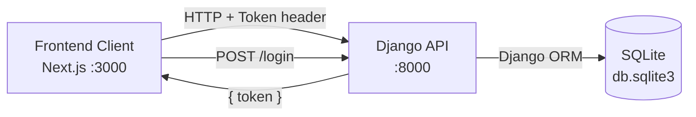
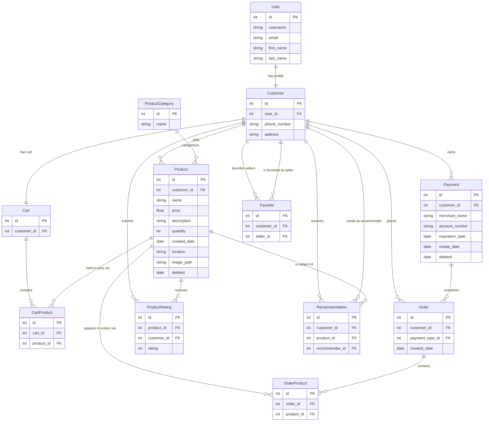

<!-- Last updated: 2026-05-23 -->
<!-- Last change: Introduced Cart and CartProduct models; separated cart from order lifecycle -->

# Bangazon Platform API - Technical Architecture

## System Overview

The Bangazon API is a Django REST Framework backend that serves a separate Next.js frontend client. The two applications run independently on localhost during development. The API handles all data persistence, business logic, and authentication. The frontend communicates exclusively through HTTP JSON requests and receives a token on login that it must include in every subsequent request header.



## Codebase Map

```text
bangazon/                   Django project config
  settings.py               App registry, DB config, DRF settings, CORS
  urls.py                   Top-level router; registers all viewsets
  wsgi.py                   WSGI entry point

bangazonapi/                Main Django app
  models/                   One file per model; all exported through __init__.py
    customer.py             Customer profile (extends Django's User)
    product.py              Product listing (soft-delete, computed properties)
    productcategory.py      Category taxonomy for products
    cart.py                 Customer cart (one per customer, created at registration)
    cartproduct.py          Join table: line items linking Cart to Product
    order.py                Completed purchase order (always has a payment_type)
    orderproduct.py         Join table: line items linking Order to Product
    payment.py              Payment type (soft-delete)
    recommendation.py       One customer recommends a product to another
    rating.py               Legacy rating model (may be unused; see Unanswered Questions)
    productrating.py        Active rating model used by Product.average_rating
    favorite.py             Customer favorites a seller (another Customer)
  views/                    One file per resource; all exported through __init__.py
    register.py             /register and /login function views (outside DRF)
    product.py              Products viewset + ProductSerializer + LineItemProductSerializer
    productcategory.py      ProductCategories viewset
    order.py                OrderViewSet + OrderSerializer (checkout and order history)
    cart.py                 CartViewSet (view, add, remove, and clear cart items)
    profile.py              Profile viewset; exposes /profile/favoritesellers
    lineitem.py             LineItems viewset (retrieve + destroy for completed order line items)
    paymenttype.py          Payments viewset
    customer.py             Customers viewset
    user.py                 Users viewset
  fixtures/                 JSON seed data loaded by seed_data.sh
  migrations/               Django DB schema migrations

tests/                      Integration tests (outside the app, separate from bangazonapi/tests.py)
  product.py                Tests for product CRUD; has TODO stubs for rating and delete
  order.py                  Tests for cart and order flow; has TODO stubs for payment and closed order
  payments.py               Payment type tests

dev-docs/                   Project documentation
manage.py                   Django CLI entry point
seed_data.sh                Drops and rebuilds the database from fixtures
```

## Entry Points

**Starting the server:** The VS Code debugger (`.vscode/launch.json`) launches `manage.py runserver`. This boots Django and starts accepting requests at `http://localhost:8000`.

**Request lifecycle:**

1. A request arrives at `bangazon/urls.py`.
2. The DRF router matches the URL to a registered viewset (e.g., `Products`, `OrderViewSet`, `CartViewSet`).
3. DRF checks the token in the `Authorization` header against `rest_framework.authtoken`.
4. The viewset method runs, queries the DB through the ORM, serializes the result, and returns a `Response`.

**Non-router routes:** `/register` and `/login` are plain Django function views in `register.py`, outside the DRF router.

## Component Breakdown

### Auth (`register.py`)

Handles registration and login. Registration creates a `User`, a linked `Customer`, a `Token`, and a `Cart` in one atomic transaction. Login returns the token and user ID. All other endpoints expect `Authorization: Token <key>` in the header.

### Products (`views/product.py`)

Full CRUD plus a custom `recommend` action (`POST /products/:id/recommend`). The `list` action supports query string filters: `category`, `quantity`, `order_by`, `direction`, `number_sold`. The `ProductSerializer` includes two computed properties from the model: `number_sold` and `average_rating`. A `LineItemProductSerializer` is also defined here for use in cart and order line item responses; it returns a minimal product representation (`id`, `name`, `price`, `description`, `is_liked`).

### Orders (`views/order.py`)

Handles listing a user's completed orders and creating a new order at checkout. `POST /orders` is the checkout endpoint: it looks up the customer's `Cart`, creates an `Order` with the provided payment type, converts each `CartProduct` into an `OrderProduct` on the new order, then deletes the cart items and the `Cart`. `GET /orders` returns only completed orders (all `Order` records have a `payment_type`). `GET /orders/:id` retrieves a single order with its line items, total, and size.

### Cart (`views/cart.py`)

All cart logic lives in `CartViewSet`. A `Cart` record is created at registration and exists permanently for each customer. Cart items are `CartProduct` records. `GET /cart` returns the cart with nested line items, total, and size, creating the cart record if it does not yet exist. `POST /cart` adds a product to the cart. `DELETE /cart/:id` removes a single `CartProduct` by its pk. `DELETE /cart/delete_all` removes all `CartProduct` records for the cart without deleting the `Cart` itself.

### Payment Types (`views/paymenttype.py`)

CRUD for payment methods. The `list` action currently returns all payment types (bug: should filter to the authenticated user's only).

### Profile (`views/profile.py`)

Returns user profile data including payment types and received recommendations. Also exposes `/profile/favoritesellers`.

### Line Items (`views/lineitem.py`)

Handles `GET /lineitems/:id` and `DELETE /lineitems/:id` for individual `OrderProduct` records on completed orders. Cart item deletion is handled separately by `CartViewSet.destroy` at `DELETE /cart/:id`.

## Data Model

A `Cart` is created for each customer at registration and persists permanently. `CartProduct` records are the items in the cart. An `Order` is only created at checkout and always has a `payment_type`. `OrderProduct` records link completed orders to the products that were purchased.



**Notes on the data model:**
- `Product` and `Payment` use `django-safedelete` with `SOFT_DELETE` policy. Deleted records stay in the database with a `deleted` timestamp instead of being removed.
- `Cart` and `Order` are now distinct concepts. A `Cart` holds items being considered; an `Order` is a completed purchase. At checkout, `CartProduct` records are converted to `OrderProduct` records on the new `Order`, then the cart items are deleted.
- `Favorite.seller` is a FK to `Customer`, not to a dedicated Store model. A Store model does not currently exist (see Unanswered Questions).

## API Design

All endpoints use JSON. Token authentication is required except for `/register` and `/login`.

| Method | URL | Description |
| ------ | --- | ----------- |
| POST | /register | Create account, returns token |
| POST | /login | Authenticate, returns token |
| GET/POST | /products | List or create products |
| GET/PUT/DELETE | /products/:id | Retrieve, update, or delete a product |
| POST | /products/:id/recommend | Recommend product to another user |
| GET/POST | /productcategories | List or create categories |
| GET | /orders | List authenticated user's completed orders |
| GET | /orders/:id | Retrieve a single completed order with line items |
| POST | /orders | Checkout: create order from cart, clears cart |
| GET | /cart | View cart with line items, total, and size |
| POST | /cart | Add a product to the cart |
| DELETE | /cart/:id | Remove a single cart item by CartProduct id |
| DELETE | /cart/delete_all | Remove all items from the cart |
| GET/DELETE | /lineitems/:id | Retrieve or remove a completed order line item |
| GET/POST | /paymenttypes | List or create payment types |
| DELETE | /paymenttypes/:id | Delete a payment type |
| GET | /profile | Get authenticated user's profile |
| GET | /profile/favoritesellers | List favorited sellers |

**Planned but not yet implemented:** `/products/:id/like`, `/products/liked`, `/profile/favoritesellers` (POST), `/stores`, `/reports/*`

## Infrastructure and Deployment

This is a local development project. There is no staging or production environment.

- **Database:** SQLite file at `db.sqlite3`
- **Reset:** Run `./seed_data.sh` to drop the database, re-run migrations, and reload all fixture data
- **Frontend:** Separate repository; CORS is configured to allow requests from `localhost:3000`
- **Media files:** Product images upload to `/media/products/` and are served at `/media/`

## Key Technical Decisions

- **DRF `ViewSet` over `ModelViewSet`:** All viewsets inherit from `ViewSet` and implement only the actions they need, rather than using `ModelViewSet` which would auto-generate all CRUD actions. This gives explicit control over what each endpoint does.
- **Token auth with `AllowAny` as default:** The global DRF permission is `AllowAny`. Individual viewsets override this with `IsAuthenticatedOrReadOnly` where needed. This means forgetting to set permissions on a new viewset leaves it open, which is worth watching.
- **Separate `Cart` and `Order` models:** A `Cart` is a permanent per-customer record that holds items under consideration. An `Order` is only created at checkout and always has a payment type. This replaces the previous convention of using `payment_type=null` on `Order` to represent an open cart, which caused `GET /orders` to include in-progress carts alongside completed purchases.
- **Two join tables (`CartProduct` and `OrderProduct`):** Rather than a single `OrderProduct` table that switches between pointing to a `Cart` or an `Order`, two separate tables make the data model explicit. `CartProduct` links `Cart` to `Product`; `OrderProduct` links `Order` to `Product`. At checkout, cart items are copied into order items and then deleted.
- **Soft delete for products and payments:** Using `django-safedelete` instead of hard deletes lets records persist for order history.

## Project Conventions

### Testing

Tests live in `tests/` (not inside the app). Each test file maps to a resource (product, order, payments). Tests use DRF's `APITestCase` and follow this pattern:

1. `setUp` registers a user via `/register` and stores the token
2. `setUp` creates required fixtures through the API (not directly in the DB)
3. Each test method calls an endpoint and asserts on the response

New tests should follow this same pattern: create what you need through the API in setup, then test behavior end to end.

### Code Style

- One model per file in `models/`, one viewset per file in `views/`
- Serializers are defined in the same file as the viewset that uses them; serializers shared across multiple viewsets live in the view file most closely associated with their model
- Query string parameters are read from `self.request.query_params.get(...)` inside `list` actions
- Custom actions on a viewset use the `@action` decorator from `rest_framework.decorators`
- View files use relative imports (`from .product import ProductSerializer`) rather than absolute package imports to avoid circular import errors

### Commits and PRs

Use the `PULL_REQUEST_TEMPLATE.md` at the repo root when opening a pull request. One ticket per branch and PR is the expected workflow.

## Unanswered Questions

**Two rating models exist.** `Rating` (in `models/rating.py`) and `ProductRating` (in `models/productrating.py`) both represent a customer rating a product. `Product.average_rating` uses `ProductRating`. It is unclear whether `Rating` is loaded by fixtures, used anywhere in the views, or is simply legacy code. The team should confirm before writing rating-related tests (Ticket 15) to avoid testing the wrong model.

**No Store model exists.** Tickets 1, 13, and 14 all require stores with a name, description, and seller relationship. Currently sellers are just `Customer` records. A new `Store` model will likely need to be created with a migration. The team should align on the data model before anyone starts those tickets.

**No templates directory exists.** Report tickets (9, 10, 11, 12, 24) require Django template rendering. A `templates/` directory will need to be created inside `bangazonapi/` before any report views can be written.
