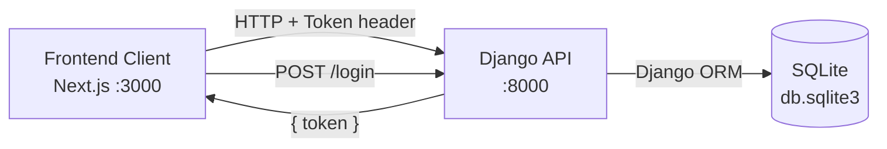
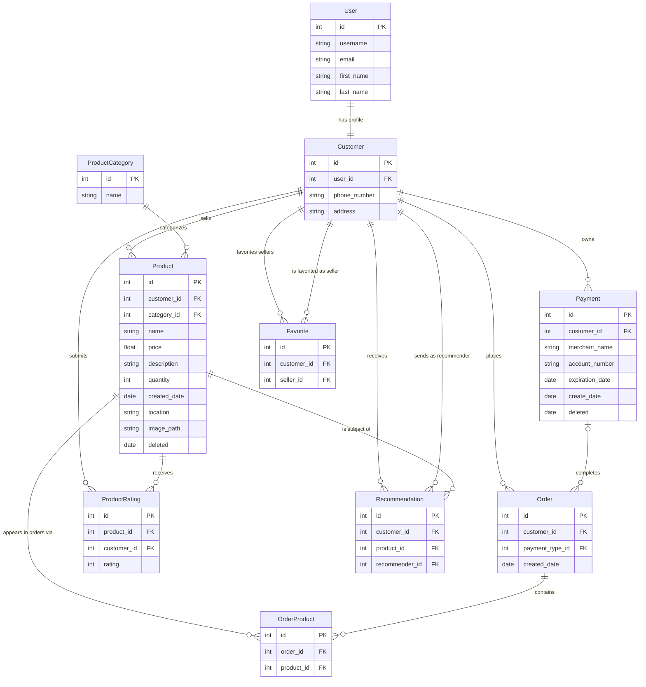

<!-- Last updated: 2026-05-04 -->
<!-- Last change: Initial architecture document (reverse-engineered from starter repo) -->

# Bangazon Platform API - Technical Architecture

## System Overview

The Bangazon API is a Django REST Framework backend that serves a separate Next.js frontend client. The two applications run independently on localhost during development. The API handles all data persistence, business logic, and authentication. The frontend communicates exclusively through HTTP JSON requests and receives a token on login that it must include in every subsequent request header.



## Codebase Map

```
bangazon/                   Django project config
  settings.py               App registry, DB config, DRF settings, CORS
  urls.py                   Top-level router; registers all viewsets
  wsgi.py                   WSGI entry point

bangazonapi/                Main Django app
  models/                   One file per model; all exported through __init__.py
    customer.py             Customer profile (extends Django's User)
    product.py              Product listing (soft-delete, computed properties)
    productcategory.py      Category taxonomy for products
    order.py                Customer order (open = no payment_type; closed = has one)
    orderproduct.py         Join table: one line item linking Order to Product
    payment.py              Payment type (soft-delete)
    recommendation.py       One customer recommends a product to another
    rating.py               Legacy rating model (may be unused; see Unanswered Questions)
    productrating.py        Active rating model used by Product.average_rating
    favorite.py             Customer favorites a seller (another Customer)
  views/                    One file per resource; all exported through __init__.py
    register.py             /register and /login function views (outside DRF)
    product.py              Products viewset + ProductSerializer
    productcategory.py      ProductCategories viewset
    order.py                Orders viewset + OrderSerializer
    cart.py                 Cart viewset (thin wrapper; see profile.py for full cart logic)
    profile.py              Profile viewset; also owns /profile/cart and /profile/favoritesellers
    lineitem.py             LineItems viewset (retrieve + destroy for individual line items)
    paymenttype.py          Payments viewset
    customer.py             Customers viewset
    user.py                 Users viewset
  fixtures/                 JSON seed data loaded by seed_data.sh
  migrations/               Django DB schema migrations

tests/                      Integration tests (outside the app, separate from bangazonapi/tests.py)
  product.py                Tests for product CRUD; has TODO stubs for rating and delete
  order.py                  Tests for cart and order flow; has TODO stubs for payment and closed order
  payments.py               Payment type tests

dev-docs/                   Project documentation
manage.py                   Django CLI entry point
seed_data.sh                Drops and rebuilds the database from fixtures
```

## Entry Points

**Starting the server:** The VS Code debugger (`.vscode/launch.json`) launches `manage.py runserver`. This boots Django and starts accepting requests at `http://localhost:8000`.

**Request lifecycle:**
1. A request arrives at `bangazon/urls.py`.
2. The DRF router matches the URL to a registered viewset (e.g., `Products`, `Orders`, `Cart`).
3. DRF checks the token in the `Authorization` header against `rest_framework.authtoken`.
4. The viewset method runs, queries the DB through the ORM, serializes the result, and returns a `Response`.

**Non-router routes:** `/register` and `/login` are plain Django function views in `register.py`, outside the DRF router.

## Component Breakdown

### Auth (`register.py`)
Handles registration and login. Registration creates a `User`, a linked `Customer`, and a `Token` in one step. Login returns the token and user ID. All other endpoints expect `Authorization: Token <key>` in the header.

### Products (`views/product.py`)
Full CRUD plus a custom `recommend` action (`POST /products/:id/recommend`). The `list` action supports query string filters: `category`, `quantity`, `order_by`, `direction`, `number_sold`. The `ProductSerializer` includes two computed properties from the model: `number_sold` and `average_rating`.

### Orders (`views/order.py`)
Handles listing a user's orders and updating an order with a payment type (which marks it complete). The open/closed distinction is entirely based on whether `payment_type` is null.

### Cart (`views/cart.py` and `views/profile.py`)
Cart logic is split across two viewsets. `Cart` handles add (`POST /cart`) and remove (`DELETE /cart/:id`). `Profile` handles get cart (`GET /profile/cart`), delete all items (`DELETE /profile/cart`), and add item (`POST /profile/cart`). Both resolve the current user's open order the same way: `Order.objects.get(customer=current_user, payment_type=None)`.

### Payment Types (`views/paymenttype.py`)
CRUD for payment methods. The `list` action currently returns all payment types (bug: should filter to the authenticated user's only).

### Profile (`views/profile.py`)
Returns user profile data including payment types and received recommendations. Also exposes `/profile/favoritesellers`.

### Line Items (`views/lineitem.py`)
Handles `GET /lineitems/:id` and `DELETE /lineitems/:id` for individual line items.

## Data Model

An order is "open" (the cart) when `payment_type` is null. Assigning a payment type closes the order.



**Notes on the data model:**
- `Product` and `Payment` use `django-safedelete` with `SOFT_DELETE` policy. Deleted records stay in the database with a `deleted` timestamp instead of being removed.
- An `Order` with `payment_type = null` is the user's active cart. There should only ever be one per customer at a time.
- `Favorite.seller` is a FK to `Customer`, not to a dedicated Store model. A Store model does not currently exist (see Unanswered Questions).

## API Design

All endpoints use JSON. Token authentication is required except for `/register` and `/login`.

| Method | URL | Description |
|--------|-----|-------------|
| POST | /register | Create account, returns token |
| POST | /login | Authenticate, returns token |
| GET/POST | /products | List or create products |
| GET/PUT/DELETE | /products/:id | Retrieve, update, or delete a product |
| POST | /products/:id/recommend | Recommend product to another user |
| GET/POST | /productcategories | List or create categories |
| GET/PUT | /orders/:id | Retrieve or complete an order (assign payment) |
| GET | /orders | List authenticated user's orders |
| GET/POST/DELETE | /cart | View cart, add item, or delete all items |
| DELETE | /cart/:id | Remove a single line item by product id |
| GET/DELETE | /lineitems/:id | Retrieve or remove a specific line item |
| GET/POST | /paymenttypes | List or create payment types |
| DELETE | /paymenttypes/:id | Delete a payment type |
| GET | /profile | Get authenticated user's profile |
| GET/POST/DELETE | /profile/cart | Cart management (mirrors /cart) |
| GET | /profile/favoritesellers | List favorited sellers |

**Planned but not yet implemented:** `/products/:id/like`, `/products/liked`, `/profile/favoritesellers` (POST), `/stores`, `/reports/*`

## Infrastructure and Deployment

This is a local development project. There is no staging or production environment.

- **Database:** SQLite file at `db.sqlite3`
- **Reset:** Run `./seed_data.sh` to drop the database, re-run migrations, and reload all fixture data
- **Frontend:** Separate repository; CORS is configured to allow requests from `localhost:3000`
- **Media files:** Product images upload to `/media/products/` and are served at `/media/`

## Key Technical Decisions

- **DRF `ViewSet` over `ModelViewSet`:** All viewsets inherit from `ViewSet` and implement only the actions they need, rather than using `ModelViewSet` which would auto-generate all CRUD actions. This gives explicit control over what each endpoint does.
- **Token auth with `AllowAny` as default:** The global DRF permission is `AllowAny`. Individual viewsets override this with `IsAuthenticatedOrReadOnly` where needed. This means forgetting to set permissions on a new viewset leaves it open, which is worth watching.
- **Open/closed order via null payment type:** Rather than an explicit status field on `Order`, the convention is that `payment_type = null` means the order is a cart. This is a simple approach but requires every query involving open orders to remember to filter by `payment_type__isnull=True`.
- **Soft delete for products and payments:** Using `django-safedelete` instead of hard deletes lets records persist for order history.

## Project Conventions

### Testing

Tests live in `tests/` (not inside the app). Each test file maps to a resource (product, order, payments). Tests use DRF's `APITestCase` and follow this pattern:

1. `setUp` registers a user via `/register` and stores the token
2. `setUp` creates required fixtures through the API (not directly in the DB)
3. Each test method calls an endpoint and asserts on the response

New tests should follow this same pattern: create what you need through the API in setup, then test behavior end to end.

### Code Style

- One model per file in `models/`, one viewset per file in `views/`
- Serializers are defined in the same file as the viewset that uses them
- Query string parameters are read from `self.request.query_params.get(...)` inside `list` actions
- Custom actions on a viewset use the `@action` decorator from `rest_framework.decorators`

### Commits and PRs

Use the `PULL_REQUEST_TEMPLATE.md` at the repo root when opening a pull request. One ticket per branch and PR is the expected workflow.

## Unanswered Questions

**Two rating models exist.** `Rating` (in `models/rating.py`) and `ProductRating` (in `models/productrating.py`) both represent a customer rating a product. `Product.average_rating` uses `ProductRating`. It is unclear whether `Rating` is loaded by fixtures, used anywhere in the views, or is simply legacy code. The team should confirm before writing rating-related tests (Ticket 15) to avoid testing the wrong model.

**No Store model exists.** Tickets 1, 13, and 14 all require stores with a name, description, and seller relationship. Currently sellers are just `Customer` records. A new `Store` model will likely need to be created with a migration. The team should align on the data model before anyone starts those tickets.

**No templates directory exists.** Report tickets (9, 10, 11, 12, 24) require Django template rendering. A `templates/` directory will need to be created inside `bangazonapi/` before any report views can be written.
